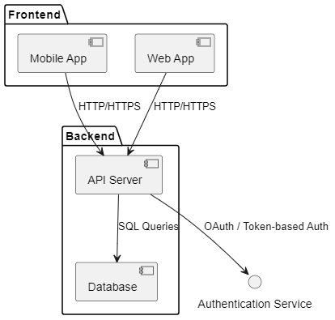

# Expense Tracker Application

## Background

This project is focused on developing an expense tracker application that can be accessed via both an Android mobile app and a responsive web app. The primary goal is to gain hands-on experience with software development and SDLC practices, while creating a useful personal tool for tracking expenses. As the project evolves, there are plans to integrate with external APIs, such as the DBS API, to automate data entry by pulling in personal transaction and account balance data.

Given that the initial scope is for personal use, the application does not need to be highly scalable at the outset, but the design should allow for easy addition of new features and improvements in scalability if needed in the future. All user data will be stored centrally to ensure synchronization between the mobile and web interfaces.

---

## Requirements

### Must Have

1. **User Authentication and Authorization**: 
   - Users must be able to sign up, log in, and log out.
   - Secure user authentication and session management.
   
2. **Expense Management**:
   - Ability to add, edit, and delete expenses manually.
   - Each expense entry must include a date, amount, category, and description.
   - Filterable expense list by date range and category.

3. **Data Synchronization**:
   - Centralized data storage accessible from both web and mobile apps.
   - Real-time or near real-time synchronization between web and mobile.

4. **Responsive Web Interface**: 
   - Usable across different devices (desktop, tablet, mobile).

5. **Mobile Interface**: 
   - Android app with an intuitive user interface.

6. **Basic Reporting**: 
   - Generate simple reports showing total expenses over a selected period, broken down by category.

7. **Security and Privacy**: 
   - Data encryption in transit and at rest.
   - Compliance with standard security practices.

### Should Have

1. **Multi-Currency Support**: 
   - Enter expenses in different currencies and convert to a base currency.

2. **Budgeting**: 
   - Set category-based budget limits with notifications.

3. **Recurring Expenses**: 
   - Support for recurring expenses like monthly subscriptions.

### Could Have

1. **Integration with External APIs (DBS API)**: 
   - Import transaction data automatically in the future.

2. **Advanced Reporting**: 
   - Visual charts and graphs for spending trends.

3. **Dark Mode**: 
   - Optional dark mode for the UI.

### Won’t Have (For Now)

1. **Social Sharing**: 
   - No social media sharing of expenses or reports.

2. **Third-Party Payment Integration**: 
   - No payment gateways for now.

---

## Architecture Overview

### High-Level Architecture

The expense tracker application will follow a client-server model with the following components:

- **Frontend**: 
  - Android Mobile App
  - Responsive Web App

- **Backend**:
  - RESTful API Server
  - Centralized PostgreSQL Database

- **Cloud Services**: 
  - Render for hosting backend
  - Firebase Auth for authentication

### Technologies 

* **Frontend**: 

   * Mobile App: Kotlin with Android SDK 

   * Web App: React.js with Axios for HTTP requests 

* **Backend**: 

   * Node.js with Express 

   * PostgreSQL for data storage 

   * JWT for authentication 

* **Hosting**: 

   * Render for API hosting 

   * PostgreSQL database on Render

---